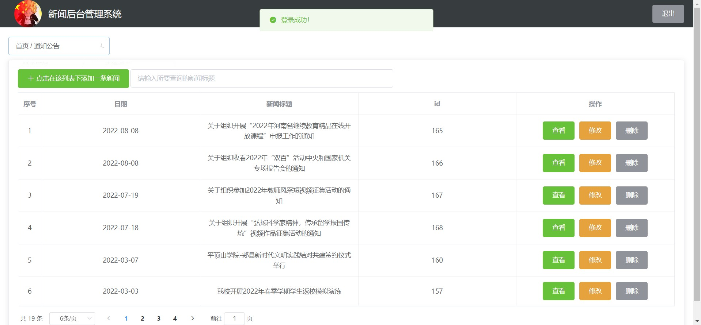
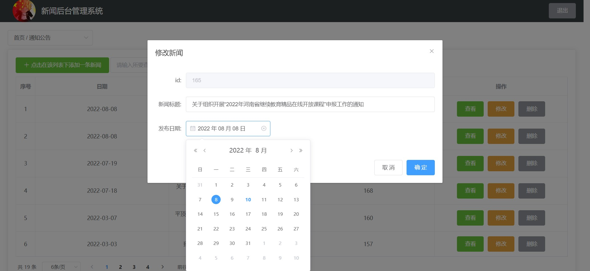
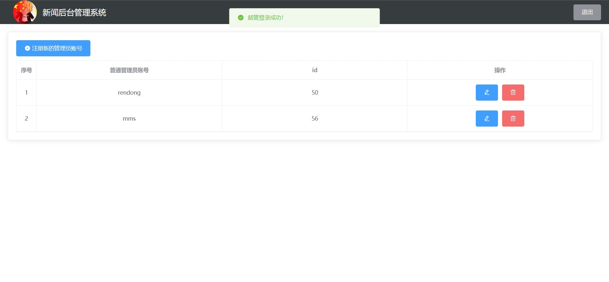

# 新闻网站

## 框架
### [Vue](https://v2.cn.vuejs.org/) [Vue-cli](https://cli.vuejs.org/zh/guide/) [Element](https://element.eleme.io/#/zh-CN)

## 推荐 IDE Setup

- [VS Code](https://code.visualstudio.com/)

## 目录
- src
  - assets 静态资源
  - components 页面
    - Administrator 后台页面
    - page 各导航栏页面
  - api 封装接口
  - plugins Element ui
  - utils 请求方法
  - https 请求方法
  - views 首页部分区域
    - homePage 更多的公共组件
  
#### 安装教程

1.  创建一个名为```news_website```的数据库
2.  导入数据库文件，可视化工具导入或使用命令行导入
3.  部署jar包，cmd进入jar包在当前目录执行

    ```java -jar school-of-journalism-and-communication-website-0.0.1-SNAPSHOT.jar```

    (注意：关闭cmd运行窗口将会终止程序运行)

4.  ```npm install```
5.  运行项目

    ```npm run serve```
#### 使用说明
    把自己数据库用户名和密码设置为root和123456，也可以到后台配置文件中自行修改
    请求路径改为/login，即http://localhost:8080/#/login，即可进入登录界面，输入用户名和密码即可进入管理员界面
    

## 预览





